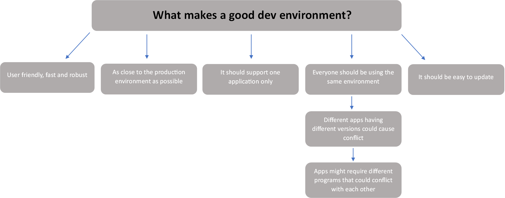
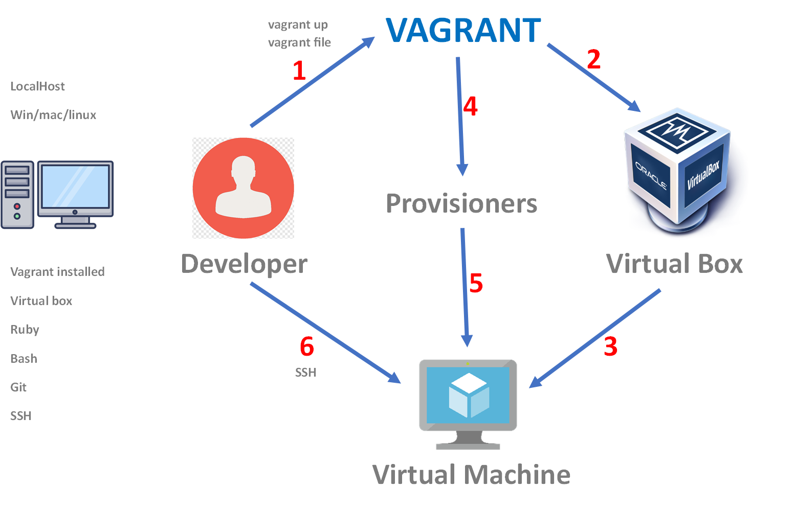
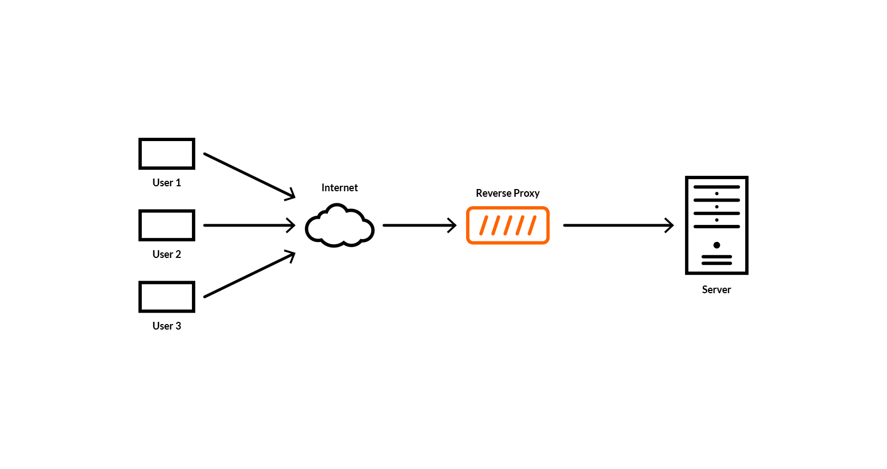

 # What is a Virtual machine?
 
A virtual machine is a software based emulation of a computer system. It creates an isolated environment within 
an existing physical machine, allowing multiple virtual machines to run simultaneously on a single physical host.
A virtual machine consists of a complete virtual hardware system, including virtual CPU, memory, storage, and network 
interfaces. It also has its own operating system and application software installed, just like a physical machine.

Virtual machines are typically used for various purposes, such as software development, testing, and deployment, 
as well as running multiple operating systems on a single physical machine. They offer several advantages, such as 
isolation, portability, and scalability.
#
# What is a Dev Environment?
A development environment, also known as a dev environment, is a setup of tools, software, and hardware that 
developers use to write, test, and debug software applications. It provides an isolated environment where developers 
can work on their code without affecting the production environment.

A typical dev environment includes a code editor, a compiler or interpreter, debugging and testing tools, and version 
control software. These tools are often integrated into a single platform or framework, such as an integrated 
development environment (IDE).



# What is the purpose of a Dev Environment?

The purpose of a dev environment is to provide developers with the necessary tools and resources to write and test 
their code efficiently and effectively. It also allows developers to collaborate on code and track changes using 
version control software.
#
#
# What is Vagrant?

Vagrant is an open-source tool that provides a simple and easy-to-use command-line interface for creating and managing 
virtual machines. It is designed to automate the setup and configuration of development environments, allowing 
developers to work in a consistent and reproducible environment across different machines and platforms.

With Vagrant, developers can define a set of instructions, known as a Vagrantfile, that describe how to configure and 
provision a virtual machine. The Vagrantfile can be version controlled and shared with other developers, making it easy 
to collaborate on a project.
#
# Vagrant diagram:

#
# Vagrant Virtualbox connection

After installing both VirtualBox and Vagrant, create a new directory for a new Vagrant Project (use git bash command mkdir <filename>).
Open the Git Bash terminal and initialise a new vagrant project using `vagrant init`
In VScode open the Vagrantfile and change the code to the following:
     
```
Vagrant.configure("2") do |config|

  config.vm.box = "ubuntu/xenial64"
end
```

- Save the vagrant file, and turn on autosave for future reference
- Start the VM by running `vagrant up`
     
We can now use `vagrant ssh` to connect via ssh to the virtual machine.
If you wish to pause the VM, use `vagrant halt`, and if you want to destroy the VM we use `vagrant destroy` - this will delete the VM.
#
# How to provision a Virtual Machine using Vagrant?
- Create a provision.sh file in the same directory as the vagrantfile.
- Enter the relevant commands you wish to be called when the script runs. (in this case, listed below), then save the file.
     
     ```
     #!/bin/bash
     sudo apt update -y
     sudo apt upgrade -y
     sudo apt install nginx -y
     sudo systemctl restart nginx
     sudo systemctl enable nginx
     ```
     
- In the vagrantfile file, add `config.vm.provision "shell", path: "provision.sh"` to the code.
- In the VScode terminal, command `vagrant up` (to launch the VM), will execute the provision script.
#
# Vagrant Commands:

$ vagrant
Usage: `vagrant [options] <command> [<args>]`

Common commands:

     autocomplete    manages autocomplete installation on host
     box             manages boxes: installation, removal, etc.
     cloud           manages everything related to Vagrant Cloud
     destroy         stops and deletes all traces of the vagrant machine    
     global-status   outputs status Vagrant environments for this user      
     halt            stops the vagrant machine
     help            shows the help for a subcommand
     init            initializes a new Vagrant environment by creating a Vagrantfile
     login
     package         packages a running vagrant environment into a box      
     plugin          manages plugins: install, uninstall, update, etc.      
     port            displays information about guest port mappings
     powershell      connects to machine via powershell remoting
     provision       provisions the vagrant machine
     push            deploys code in this environment to a configured destination
     rdp             connects to machine via RDP
     reload          restarts vagrant machine, loads new Vagrantfile configuration
     resume          resume a suspended vagrant machine
     serve           start Vagrant server
     snapshot        manages snapshots: saving, restoring, etc.
     ssh             connects to machine via SSH
     ssh-config      outputs OpenSSH valid configuration to connect to the machine
     status          outputs status of the vagrant machine
     suspend         suspends the machine
     up              starts and provisions the vagrant environment
     upload          upload to machine via communicator
     validate        validates the Vagrantfile
     version         prints current and latest Vagrant version
     winrm           executes commands on a machine via WinRM
     winrm-config    outputs WinRM configuration to connect to the machine  

For help on any individual command run `vagrant COMMAND -h`
#
# Installing an app on the Virtual Machine using vagrant

We want to install an app on the virtual machine using vagrant:
 
1. Sync the 'app' folder by adding `config.vm.synced_folder "app", "/home/vagrant/app"` to the vagrantfile
2. Run the `vagrant up` command in the VScode terminal to launch the VM
3. Once the VM is running, head over to the git bash terminal and `vagrant ssh` to connect into the VM
4. use `ls` to check if the 'app' folder has been synced
5. In the VScode terminal, use `cd environment/spec-tests` to enter the spec-tests directory
6. Now we need to install bundle to run the tests. Enter `gem install bundle`
7. Use command `bundle` to bundle up the tests
8. Now use `rake spec` to launch the tests
9. After checking all the tests, some of them will show as failed. To fix this we need to install all the missing packages
10. Back in Git bash, navigate to the vagrantfile dir
11. Install NodeJS with `sudo apt-get install nodejs -y`
12. When NodeJs is finished installing, we can install python properties with `sudo apt-get install python-software-properties -y`
13. Next we install the specific version with `curl -sL https://deb.nodesource.com/setup_6.x | sudo -E bash -` this ensures that it's nodejs version 6.x.
14. Run `sudo apt-get install nodejs -y` again and then `nodejs --version` to check it's correct
15. Now we need to install the package manager for node using `sudo npm install pm2 -g`
16. In VS Code terminal we can run `rake spec` to see if the tests have passed
17. Next we need to go back to GitBash, go into the app folder by using `cd app`
18. Use `npm install` and then `node app.js` to launch the app

- To check if everything works, enter http://192.168.10.100:3000 into the web browser
#
# Using the provision script to automate the installation and launching of an App in the virtual machine:

- Add the following code to the provision script:
```
sudo apt install nodejs -y
sudo apt install python-software-properties
curl -sL https://deb.nodesource.com/setup_6.x | sudo -E bash -
sudo apt install nodejs -y

sudo npm install pm2 -g

cd /home/vagrant/app; npm install
cd /home/vagrant/app; node app.js
```
- Now run `vagrant up` and this will run the VM with nginx installed and the Node.js app installed and running

#
# What are Ports?
 
IP ports are a mechanism used by the Internet Protocol (IP) to identify specific applications or services running on a computer or other network device. Ports are numbered, and each port is associated with a particular protocol or type of service. A computer port is essentially a type of electronic docking point through which information flows from a program on your computer or to your computer from the Internet or another computer in a network.
 
Ports are numbered for consistency and programming. The most commonly used and best-known ports are those numbered 0 to 1023 dedicated for Internet use, but they can extend far higher for specialized purposes. Each port set or range is assigned specialized jobs or functions, and that’s generally all they do. Usually, all identical system services or functions use the same port numbers on the receiving servers.
#
# What is a Reverse Proxy and how is it different to a Proxy?
 
A reverse proxy is a type of proxy server that sits between a client and a server. It handles requests from clients on behalf of the server. Unlike a traditional proxy server, which forwards requests from a client to a server, a reverse proxy receives requests from the internet and forwards them to the appropriate server. Also, from a security perspective, a reverse proxy can help protect the servers behind it from attacks by intercepting and filtering incoming traffic.

The main difference between a reverse proxy and a traditional proxy server is the direction of the communication flow. In a traditional proxy server, the client sends requests to the proxy server, which then forwards them to the destination server. In contrast, in a reverse proxy scenario, the client sends requests to the reverse proxy, which then forwards the requests to the appropriate server on behalf of the client.

Reverse proxies can be used for various purposes, including load balancing, caching, and security. By sitting in front of one or more servers, a reverse proxy can distribute incoming traffic across multiple servers, helping to balance the load and prevent any one server from becoming overwhelmed. Additionally, a reverse proxy can cache frequently requested content, reducing the load on the servers and improving response times for clients.
 


#
# What is Nginx default configuration?

- the default configuration file for Nginx is usually located at /etc/nginx/nginx.conf.
 
A default configuration file is a pre-configured file that comes with a software application or service. It is designed to provide a basic setup for the application or service, which can be modified or customized as per the user's requirements.

the default Nginx configuration includes a 'sites-available' directory, which contains configuration files for virtual hosts or websites.

Within the sites-available directory, there is typically a default virtual host configuration file named default. This file specifies the settings for the default virtual host, which is used when no other virtual hosts are specified.

The default configuration file contains the following settings:

- server_name: This specifies the server's domain name or IP address.

- listen: This specifies the port on which Nginx should listen for incoming connections.

- root: This specifies the root directory for the website's files.

- index: This specifies the default index file for the website.

- error_page: This specifies the location of the custom error pages for the website.

- access_log: This specifies the location and format of the access log file.

- location /: This specifies how Nginx should handle requests for the root directory of the website.

#
# Setting up a Nginx Reverse Proxy:
 
1. Use `sudo nano /etc/nginx/sites-available/reverse-proxy` to create a reverse proxy file
2. Add the following code:
 
```
server {
   listen 80;
   server_name 192.168.10.100;

   location / {
       proxy_pass http://192.168.10.100:3000;
       proxy_set_header Host $host;
       proxy_set_header X-Real-IP $remote_addr;
       proxy_set_header X-Forwarded-For $proxy_add_x_forwarded_for;
       proxy_set_header X-Forwarded-Proto $scheme;
   }
}
```
Go to `cd /etc/hosts` file and include the following code to define the hostname in the DNS:

`192.168.1.100   backend-server`

check the configuration file for errors
 
`sudo nginx -t`
 
Now reload nginx
 
`sudo systemctl reload nginx`
 
- Enter the ip into the web browser to test the app is working
 
#
# Creating multiple VM's with vagrant

We can create multiple VM's with vagrant by editting the vagrantfile:
```
Vagrant.configure("2") do |config|

  config.vm.define "app" do |app| # everything under this is refering to 'app'
    app.vm.box = "ubuntu/xenial64"
    app.vm.network "private_network", ip: "192.168.10.100" # connect via browser
    # config.vm.network "forwarded_port", guest: 80, host: 80

    # run the provision script for the VM
    app.vm.provision "shell", path: "provision.sh"

    # syncing the app folder 
    app.vm.synced_folder "app", "/home/vagrant/app" # the full dir of the app

  end
  # created a second VM
  config.vm.define "db" do |db|
    db.vm.box = "ubuntu/xenial64"
    db.vm.network "private_network", ip: "192.168.10.150"

  end  

end
```

We created two 'vm.define' sections of code and defined them with the relevant VM names. in this case, 'app' and 'db'.
We separate the two sections with indentation, adding `end` to close each section/VM.
