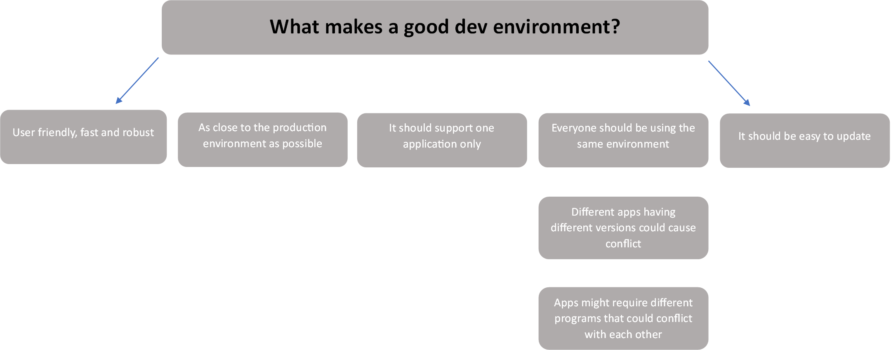

 # What is a Virtual machine?
 
A virtual machine is a software based emulation of a computer system. It creates an isolated environment within 
an existing physical machine, allowing multiple virtual machines to run simultaneously on a single physical host.
A virtual machine consists of a complete virtual hardware system, including virtual CPU, memory, storage, and network 
interfaces. It also has its own operating system and application software installed, just like a physical machine.

Virtual machines are typically used for various purposes, such as software development, testing, and deployment, 
as well as running multiple operating systems on a single physical machine. They offer several advantages, such as 
isolation, portability, and scalability.
#
# What is a Dev Environment?
A development environment, also known as a dev environment, is a setup of tools, software, and hardware that 
developers use to write, test, and debug software applications. It provides an isolated environment where developers 
can work on their code without affecting the production environment.

A typical dev environment includes a code editor, a compiler or interpreter, debugging and testing tools, and version 
control software. These tools are often integrated into a single platform or framework, such as an integrated 
development environment (IDE).

# What is the purpose of a Dev Environment?

The purpose of a dev environment is to provide developers with the necessary tools and resources to write and test 
their code efficiently and effectively. It also allows developers to collaborate on code and track changes using 
version control software.